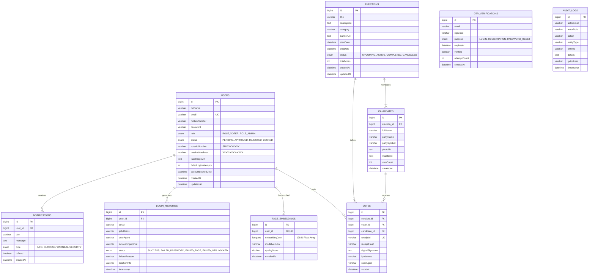

# SmartVote AI — Database Schema Documentation

SmartVote AI uses MySQL 8.0 with Spring Data JPA and Hibernate for automatic schema generation, indexing, and transactional integrity.

---

## 1. Entity-Relationship (ER) Diagram

---

## 2. Table Specifications & Security Constraints

### 2.1 `users`
- **Primary Key**: `id` (Auto-increment `BIGINT`)
- **Unique Indexes**: `idx_user_email` (`email`)
- **Key Fields**:
  - `password`: BCrypt 10-round salted hash. Raw plaintext passwords are never stored.
  - `role`: Enum `ROLE_VOTER` or `ROLE_ADMIN`.
  - `status`: Enum `PENDING`, `APPROVED`, `REJECTED`, `LOCKED`.
  - `failedLoginAttempts`: Counter incremented on invalid passwords or failed face matches. Automatically triggers account freeze at 5 attempts.

### 2.2 `face_embeddings`
- **Primary Key**: `id`
- **Foreign Key**: `user_id` referencing `users(id)` (Strict `1:1` relationship, `ON DELETE CASCADE`)
- **Key Fields**:
  - `embeddingJson`: Serialized JSON array of 128 normalized float values produced by Face-api.js.
  - `qualityScore`: Quality confidence between 0.00 and 1.00.

### 2.3 `elections`
- **Primary Key**: `id`
- **Indexes**: `idx_election_status` (`status`), `idx_election_dates` (`startDate`, `endDate`)
- **Key Fields**:
  - `status`: `UPCOMING`, `ACTIVE`, `COMPLETED`, `CANCELLED`.
  - `totalVotes`: Atomic tally maintained on ballot confirmation.

### 2.4 `candidates`
- **Primary Key**: `id`
- **Foreign Key**: `election_id` referencing `elections(id)` (`ON DELETE CASCADE`)
- **Key Fields**:
  - `voteCount`: Atomic tally incremented transactionally.

### 2.5 `votes` (Cryptographic Ballot Ledger)
- **Primary Key**: `id`
- **Unique Constraints**:
  - `uk_election_voter`: `UNIQUE(election_id, voter_id)` $\rightarrow$ **Physically prevents duplicate voting at the database engine level.**
  - `uk_receipt_id`: `UNIQUE(receiptId)` $\rightarrow$ Enforces globally unique receipt codes.
- **Key Fields**:
  - `receiptId`: Format `SMV-2026-XXXXXXXX`
  - `receiptHash`: SHA-256 seal: $\text{SHA256}(\text{receiptId} + \text{electionId} + \text{candidateId} + \text{voterId} + \text{timestamp})$
  - `digitalSignature`: Base64 encoded RSA/HMAC signature sealing the record against tamper.

### 2.6 `otp_verifications`
- **Primary Key**: `id`
- **Indexes**: `idx_otp_email_purpose` (`email`, `purpose`)
- **TTL**: Codes expire automatically after 120 seconds (`expiresAt`). Maximum 5 attempts allowed.
