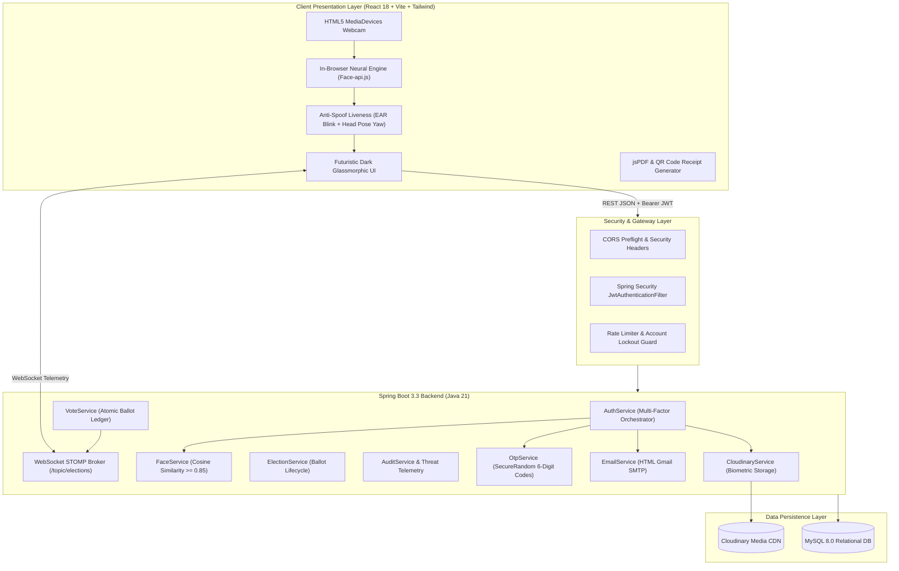
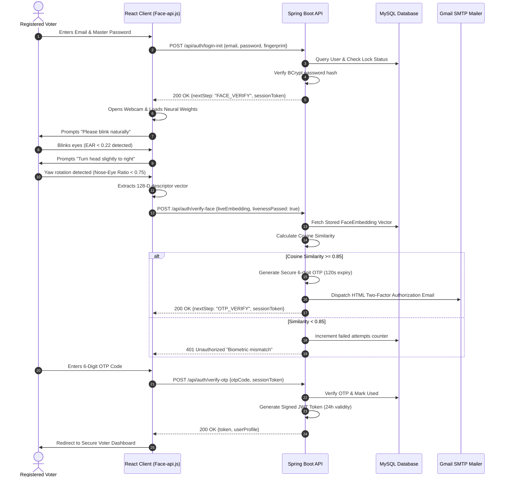
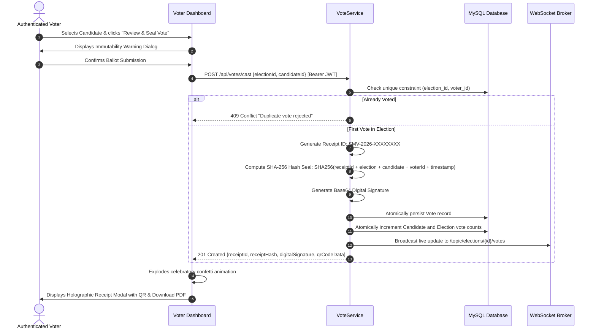

# SmartVote AI — System Architecture & Design

SmartVote AI is an enterprise-grade cryptographic democratic voting engine built on modern cloud-native principles, browser-native biometrics, and zero-knowledge receipts.

---

## 1. High-Level Architecture Overview

SmartVote AI decouples biometric authentication, cryptographic ballot sealing, and administrative telemetry into resilient modular layers.

---

## 2. Multi-Stage Biometric Authentication Flow

The following sequence diagram details the 3-stage authentication protocol verifying password credentials, browser-native biometric liveness, and two-factor OTP:

---

## 3. Cryptographic Ballot Sealing Protocol

To ensure one-voter-one-vote and zero-knowledge verification, the vote casting protocol executes as follows:

---

## 4. Zero-Knowledge Public Receipt Verification

SmartVote AI enables public verifiability without violating the secret ballot:
1. When a vote is cast, a unique public receipt ID `SMV-2026-XXXXXXXX` is generated.
2. The receipt hash is calculated:
   $$\text{ReceiptHash} = \text{SHA256}(\text{receiptId} \,\|\, \text{electionId} \,\|\, \text{candidateId} \,\|\, \text{voterId} \,\|\, \text{salt})$$
3. Anyone holding the receipt ID can query `GET /api/votes/verify-receipt/{receiptId}`.
4. The system confirms:
   - Receipt exists on the ledger.
   - Associated election title and recorded candidate selection.
   - Timestamp and digital seal.
   - **Crucially: The voter's private personal identity is completely omitted from the public verification response.**
